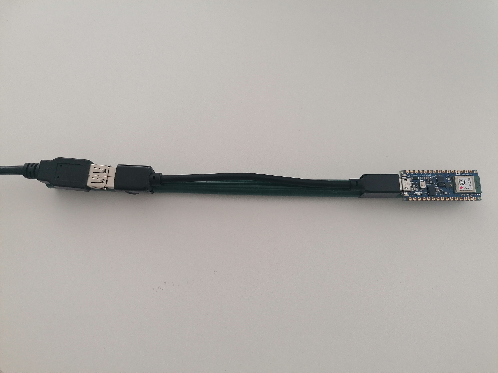
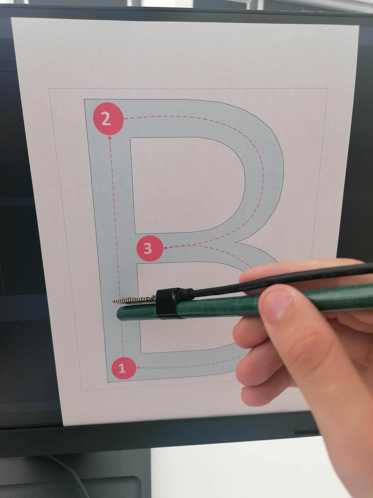
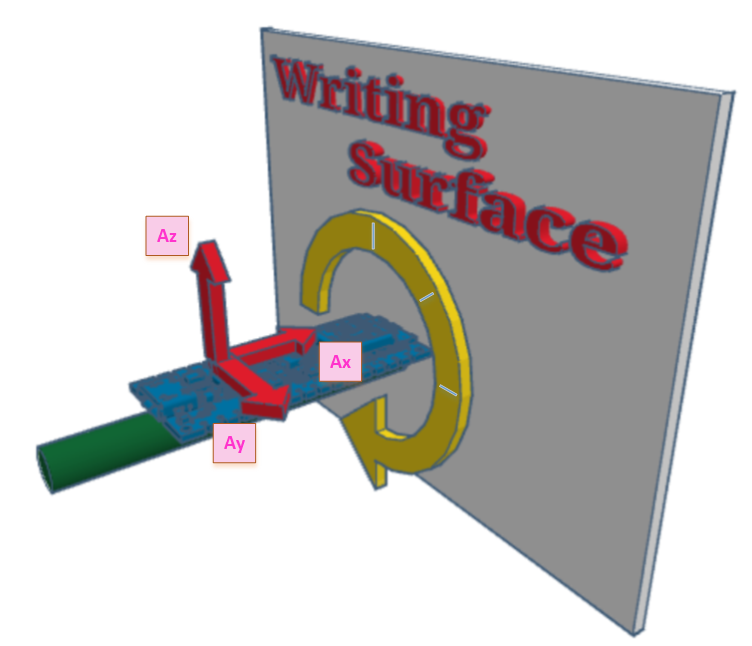

# Over the Air Character Recognition [AirChar IMU Data Acquisition, Filtering, and Augmentation]

This repository contains the workflow used to **acquire**, **store**, and **augment** inertial data for the _AirChar_ project, focused on **handwritten character recognition in the air** using motion sensors.

---

## Overview

The system is based on an **Arduino Nano 33 BLE Sense**, which includes a built-in **9-axis IMU (LSM9DS1)** capable of measuring 3-axis acceleration and angular velocity.

Data collection, storage, and preprocessing are divided into three main components:

1. **`AirCharLogger.ino`** – Arduino firmware for real-time data acquisition.  
2. **`main.py`** – Python script to download serial data and save it into structured CSV files.  
3. **`dataAug.py` / `main.py`** – Python modules for data augmentation through 3D vector rotations.




## 1. Data Acquisition

The Arduino sketch [`AirCharLogger.ino`](./AirCharLogger.ino) configures the IMU and continuously logs:

- **Accelerometer:** `AccX`, `AccY`, `AccZ` (in *m/s²*)  
- **Gyroscope:** `GyrX`, `GyrY`, `GyrZ` (in *°/s*)  

Each record corresponds to a single IMU reading captured at **100 Hz**.  
Data is sent via the **serial port** to a host computer.




## 2. Data Download and Storage

A Python script (e.g., [`download_data.py`](./download_data.py)) reads the serial output and saves it into a structured CSV file with the following format:

AirChar - The in-the-Air Handwritten Dataset
for Character Recognition Based on Acceleration (IMU) Data

IMU: LSM9DS1
Sampling Frequency: 100Hz
FileName: A_s01v01n0001p0a0f0.csv
Character: A
Subject: 01
Version: 01
Sample Number: 0001
Preprocessing Filter: No
Augmentation: No
Features: No
Format: csv

Label;accX;accY;accZ;gyrX;gyrY;gyrZ
65;-0.237061;-0.019043;0.928101;3.173828;-0.244141;2.258301
65;-0.245972;-0.014648;0.925659;2.990723;-1.037598;2.746582
...


### File naming convention
Each raw sample follows the structure:

A_s01v01n0001p0a0f0.csv

│  │  │   │  │ │ │

│  │  │   │  │ │ └── fixed metadata

│  │  │   │  │ └──── augmentation marker (a0)

│  │  │   │  └────── participant posture / position

│  │  │   └──────────── sample number

│  │  └─────────────── version number

│  └────────────────── subject ID

└──────────────────── recorded character


### 3. Data Filtering (MATLAB)

After collecting and saving the raw IMU data, a **preprocessing and filtering stage** is performed in **MATLAB** to smooth the signals and remove unwanted high-frequency noise.  
This step is essential to ensure that the subsequent data augmentation is applied to clean and physically meaningful motion signals.

The filtering is implemented through the MATLAB function [`AddFilter.m`](./MATLAB/AddFilter.m), which performs the following operations:

1. **Reads the raw CSV file** from the `Samples/` directory.  
   Each file contains a 17-line metadata header followed by the numeric IMU data starting on line 18.  
   The sampling frequency is **100 Hz**, as defined by the acquisition system.

2. **Applies a 4th-order low-pass Butterworth filter** with a cutoff frequency of **10 Hz**, using:
   ```matlab
   [b, a] = butter(4, 10 / (100 / 2));
   filteredData = filtfilt(b, a, data);

This configuration effectively removes high-frequency noise from both the acceleration and angular velocity channels while maintaining signal phase integrity.

3. **Updates the metadata header** to indicate that filtering has been applied.
The line:
Preprocessing Filter: No
is replaced by:
Preprocessing Filter: Yes

4. **Generates a new filtered file** in the Filtered/ directory.
The filename is updated to reflect the filtering stage by replacing p0 with p1.
Example:
Samples/A_s01v01n0001p0a0f0.csv
        ↓
Filtered/A_s01v01n0001p1a0f0.csv

5. **Optionally visualizes the signals** when the PLOT parameter is enabled:
AddFilter('A_s01v01n0001p0a0f0.csv', 1);

This command displays acceleration and angular velocity plots before and after filtering, allowing verification of filter performance.


## 4. Data Augmentation

To improve dataset diversity, a **data augmentation** step is applied using the scripts:

- [`dataAug.py`](./dataAug.py) — defines all augmentation routines  
- [`main.py`](./main.py) — batch processes all `.csv` files in the `samples/` directory

Each dataset is augmented by applying **3D rotations** of the acceleration and gyroscope vectors around the **X**, **Y**, and **Z** axes, for the following angles:
±15°, ±30°, ±45°

This results in **18 augmented versions** per original file, simulating different sensor orientations during motion capture.




## 5. Output Structure

Augmented files are stored in the folder `samplesAug/`.  
Each one preserves the original metadata header, with the following automatic modifications:

- The line becomes "Augmentation: No" becomes "Augmentation: Yes (x+15)"
where `x` is the rotation axis and `+15` is the applied angle.

- The filename reflects the augmentation, replacing `a0` with the specific axis and angle:  
A_s01v01n0001p0a0f0.csv → A_s01v01n0001p0ax+15f0.csv


Thus, each augmented file remains fully traceable to its source and transformation parameters.


## Example Workflow

```bash
# 1. Collect data using Arduino
#    (upload and run AirCharLogger.ino)
# 2. Download and save IMU stream:
python download_data.py
# 3. Filter the data noise using the MatLab script
# 4. Run data augmentation:
python main.py

All code and dataset formats are released under the Apache License 2.0
© 2025 Laboratory of Electronics and Instrumentation (LEI),
Portalegre Polytechnic University.
